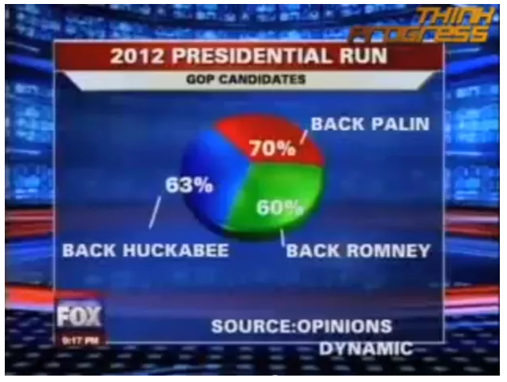

::: watermark

:::

# Visualización

"El análisis exploratorio de datos se refiere al **proceso de realizar investigaciones iniciales sobre los datos** para descubrir patrones, detectar anomalías, probar hipótesis y verificar suposiciones con la ayuda de estadísticas resumidas y representaciones gráficas." [Towards](https://towardsdatascience.com/exploratory-data-analysis-8fc1cb20fd15)

```{r echo=FALSE,fig.align='center'}
  knitr::include_graphics("img/03-geda/investigadora.png")
```

## EDA: Análisis Exploratorio de Datos

Un análisis exploratorio de datos tiene principalmente 5 objetivos:

1.  Maximizar el conocimiento de un conjunto de datos
2.  Descubrir la estructura subyacente de los datos
3.  Extraer variables importantes
4.  Detectar valores atípicos y anomalías
5.  Probar los supuestos subyacentes

**EDA no es idéntico a los gráficos estadísticos** aunque los dos términos se utilizan casi indistintamente. Los gráficos estadísticos son una colección de técnicas, todas basadas en gráficos y todas centradas en un aspecto de caracterización de datos. EDA abarca un lugar más grande. EDA es una filosofía sobre cómo diseccionar un conjunto de datos; lo que buscamos; cómo nos vemos; y cómo interpretamos.

Los científicos de datos pueden utilizar el análisis exploratorio para garantizar que los resultados que producen sean válidos y aplicables a los resultados y objetivos comerciales deseados.

EDA se utiliza principalmente para ver qué datos pueden revelar más allá del modelado formal o la tarea de prueba de hipótesis y proporciona una mejor comprensión de las variables del conjunto de datos y las relaciones entre ellas. También puede ayudar a determinar si las técnicas estadísticas que está considerando para el análisis de datos son apropiadas.

```{r echo=FALSE,fig.align='center', out.width = "500pt"}
  knitr::include_graphics("img/03-geda/meme-iniciar.jpg")
```

Dependiendo del tipo de variable queremos obtener la siguiente información:

-   **Variables numéricas:**

    -   Tipo de dato: float, integer
    -   Número de observaciones
    -   Mean
    -   Desviación estándar
    -   Cuartiles: 25%, 50%, 75%
    -   Valor máximo
    -   Valor mínimo
    -   Número de observaciones únicos
    -   Top 5 observaciones repetidas
    -   Número de observaciones con valores faltantes
    -   ¿Hay redondeos?

-   **Variables categóricas**

    -   Número de categorías
    -   Valor de las categorías
    -   Moda
    -   Valores faltantes
    -   Número de observaciones con valores faltantes
    -   Proporción de observaciones por categoría
    -   Top 1, top 2, top 3 (moda 1, moda 2, moda 3)
    -   Faltas de ortografía ?

-   **Fechas**

    -   Fecha inicio
    -   Fecha fin
    -   Huecos en las fechas: sólo tenemos datos entre semana, etc.
    -   Formatos de fecha (YYYY-MM-DD)
    -   Tipo de dato: date, time, timestamp
    -   Número de faltantes (NA)
    -   Número de observaciones

-   **Texto**

    -   Longitud promedio de cada observación
    -   Identificar el lenguaje, si es posible
    -   Longitud mínima de cada observación
    -   Longitud máxima de cada observación
    -   Cuartiles de longitud: 25%, 50%, 75%

-   **Coordenadas geoespaciales**

    -   Primero se pone la latitud y luego la longitud
    -   Primer decimal: 111 kms
    -   Segundo decimal: 11.1 kms
    -   Tercer decimal: 1.1 kms
    -   Cuarto decimal: 11 mts
    -   Quinto decimal: 1.1 mt
    -   Sexto decimal: 0.11 mts
    -   Valores que están cercanos al 100 representan la longitud
    -   El símbolo en cada coordenada representa si estamos al norte (positivo) o sur (negativo) -en la latitud-, al este (positivo) o al - oeste (negativo) -en la longitud-.

## GEDA: Análisis Exploratorio de Datos Gráficos

Como complemento al EDA podemos realizar un GEDA, que es un análisis exploratorio de los datos apoyándonos de visualizaciones, la visualización de datos no trata de hacer gráficas "bonitas" o "divertidas", ni de simplificar lo complejo. Más bien, trata de aprovechar nuestra gran capacidad de procesamiento visual para exhibir de manera clara aspectos importantes de los datos.

### Lo que no se debe hacer...

```{r echo=FALSE,fig.align='center', out.width = "500pt"}
  knitr::include_graphics("img/03-geda/meme-tecnicamente.png")
```

Fuentes: [WTF Visualizations](https://viz.wtf/) [Flowingdata](https://flowingdata.com/2010/05/14/wait-something-isnt-right-here/)

```{r echo=FALSE,fig.align='center', out.width = "600pt"}
  knitr::include_graphics("img/03-geda/bad_viz1.png")
```

```{r echo=FALSE,fig.align='center', out.width = "700pt"}
  knitr::include_graphics("img/03-geda/bad_viz2.png")
```

```{r echo=FALSE,fig.align='center', out.width = "700pt"}
knitr::include_graphics("img/03-geda/bad_viz3.png")
```

```{r echo=FALSE,fig.align='center', out.width = "700pt"}
  knitr::include_graphics("img/03-geda/bad_viz4.jpg")
```

```{r echo=FALSE,fig.align='center', out.width = "700pt"}
  
```

```{r echo=FALSE,fig.align='center', out.width = "700pt"}
  knitr::include_graphics("img/03-geda/bad_viz6.jpg")
```

### Principios de visualización

-   El objetivo de una visualización es sintetizar información relevante al análisis presentada de manera sencilla y sin ambigüedad. **Lo usamos de apoyo para explicar a una audiencia más amplia que puede no ser tan técnica.**

-   Una gráfica debe reportar el resultado de un análisis detallado, nunca lo reemplaza.

-   No hacer gráficas porque se vean "cool"

-   Antes de hacer una gráfica, debe pensarse en lo que se quiere expresar o representar

-   Existen "reglas" o mejores gráficas para representar cierto tipo de información de acuerdo a los tipos de datos que se tienen o al objetivo se quiere lograr con la visualización. [From Data to Viz](https://www.data-to-viz.com/caveats.html)

-   No utilizar pie charts

### Principios generales del diseño analítico:

-   Muestra comparaciones, contrastes, diferencias.

-   Muestra causalidad, mecanismo, explicación.

-   Muestra datos multivariados, es decir, más de una o dos variables.

-   Integra palabras, números, imágenes y diagramas.

-   Las presentaciones analíticas, a fin de cuentas, se sostienen o caen dependiendo de la calidad, relevancia e integridad de su contenido.

Esta categoría incluye técnicas específicas que dependen de la forma de nuestros datos y el tipo de pregunta que queremos investigar:

### Técnicas de visualización:

-   *Tipos de gráficas*: cuantiles, histogramas, caja y brazos, gráficas de dispersión, puntos/barras/ líneas, series de tiempo.

-   *Técnicas para mejorar gráficas*: Transformación de datos, transparencia, vibración, suavizamiento y bandas de confianza.

### Indicadores de calidad gráfica:

Aplicables a cualquier gráfica en particular, son guías concretas y relativamente objetivas para evaluar la calidad de una gráfica.

-   *Integridad Gráfica*: El factor de engaño, es decir, la distorsión gráfica de las cantidades representadas, debe ser mínimo.

-   *Chartjunk*: Minimizar el uso de decoración gráfica que interfiera con la interpretación de los datos: 3D, rejillas, rellenos con patrones.

-   *Tinta de datos*: Maximizar la proporción de tinta de datos vs. tinta total de la gráfica. La regla es: si hay tinta que no representa variación en los datos, o la eliminación de esa tinta no representa pérdidas de significado, esa tinta debe ser eliminada. El ejemplo más claro es el de las rejillas en gráficas y tablas:

```{r echo=FALSE,fig.align='center' ,out.width='700pt', out.height='300pt'}
knitr::include_graphics("img/03-geda/tinta.png")
```

-   *Densidad de datos:* Las mejores gráficas tienen mayor densidad de datos, que es la razón entre el tamaño del conjunto de datos y el área de la gráfica.

### Gráficos univariados:

-   *Histograma:* El histograma es la forma más popular de mostrar la forma de un conjunto de datos. Se divide la escala de la variable en intervalos, y se realiza un conteo de los casos que caen en cada uno de los intervalos. Los histogramas pueden mostrar distintos aspectos de los datos dependiendo del tamaño y posición de los intervalos.

<br>

```{r echo=FALSE, out.width = "500pt", out.height="250pt",fig.align='center'}
knitr::include_graphics("img/03-geda/histograma.jpg")
```

-   *Diagramas de caja y brazos:* Es un método estandarizado para representar gráficamente una serie de datos numéricos a través de sus cuartiles. El diagrama de caja muestra a simple vista la mediana y los cuartiles de los datos, pudiendo también representar los valores atípicos de estos.

```{r echo=FALSE, out.width = "500pt", out.height="250pt",fig.align='center'}
knitr::include_graphics("img/03-geda/boxplot.png")
```

-   *Gráficas de barras*: Una gráfica de este tipo nos muestra la frecuencia con la que se han observado los datos de una variable discreta, con una barra para cada categoría de esta variable.

<br>

```{r echo=FALSE, out.width = "500pt", out.height="250pt",fig.align='center'}
knitr::include_graphics("img/03-geda/barras.jpg")
```

-   *Gráficos Circulares (Pie Charts):* Un gráfico circular o gráfica circular, también llamado "gráfico de pastel", es un recurso estadístico que se utiliza para representar porcentajes y proporciones.

<br>

```{r echo=FALSE, out.width = "500pt", out.height="280pt",fig.align='center'}

```

### Gráficos multivariados

-   *Gráfico de dispersión:* Los gráficos de dispersión se usan para trazar puntos de datos en un eje vertical y uno horizontal, mediante lo que se trata de mostrar cuánto afecta una variable a otra. Si no existe una variable dependiente, cualquier variable se puede representar en cada eje y el diagrama de dispersión mostrará el grado de correlación (no causalidad) entre las dos variables.

```{r echo=FALSE, out.width = "500pt", out.height="350pt",fig.align='center'}
knitr::include_graphics("img/03-geda/dispersion.png")
```

-   *Gráficas de líneas:* Uno de los tipos de gráfica más utilizados es la de líneas, especialmente cuando se quieren comparar visualmente varias variables a lo largo del tiempo o algún otro parámetro.

```{r echo=FALSE, out.width = "500pt", out.height="300pt",fig.align='center'}
knitr::include_graphics("img/03-geda/lineas.jpg")
```


### ¡ Warning ! {.unnumbered}

Nunca se debe olvidar que debemos de analizar los datos de manera objetiva, nuestro criterio sobre un problema o negocio no debe de tener sesgos sobre lo que "nos gustaría encontrar en los datos" o lo "que creemos que debe pasar"....

```{r echo=FALSE,fig.align='center', out.width = "500pt"}
  knitr::include_graphics("img/03-geda/datosgato.jpeg")
```

